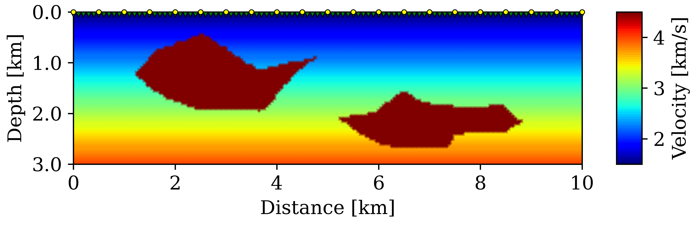
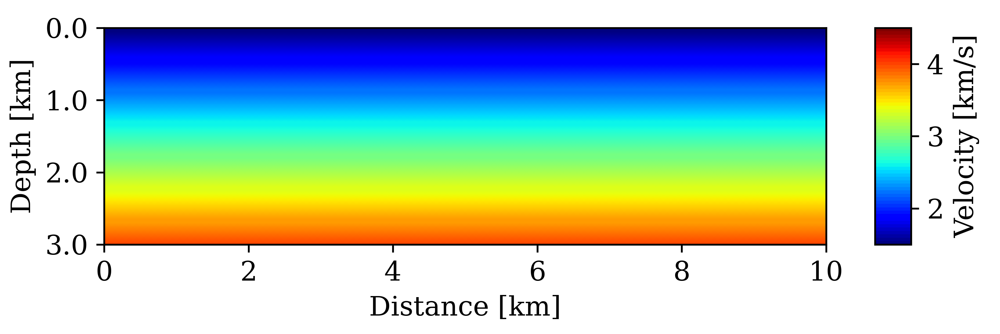
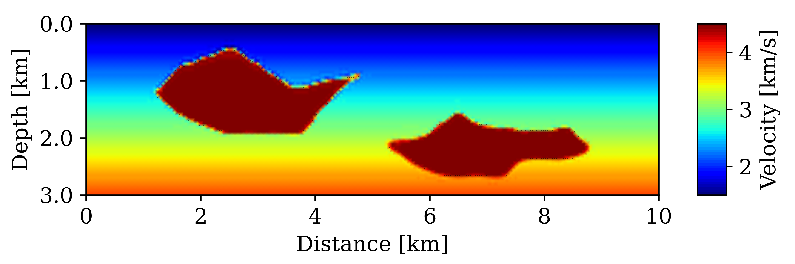
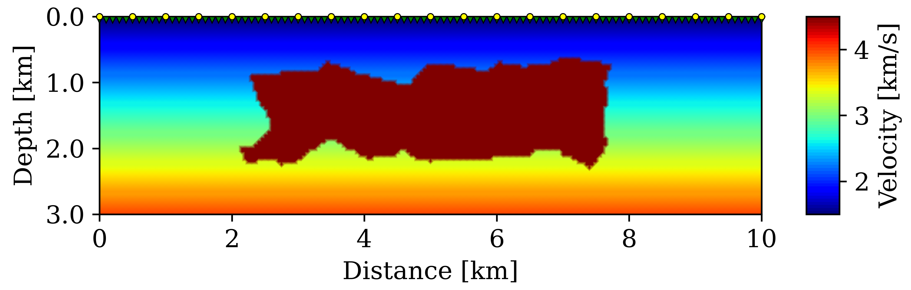
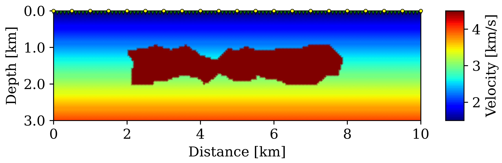
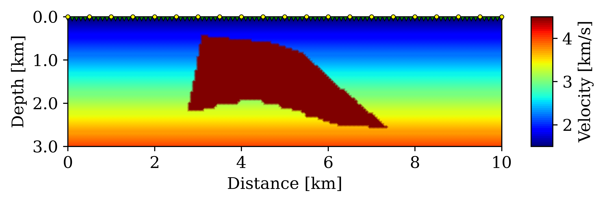

# TopOptFWI 

Full Waveform Inversion (FWI) appoach based on Topology Optimization (TO) for the salt reconstruction problem. 

## Problem Description

* The wave propagation problem in the frequency domain is solved using a Finite Element (FE) model.
* Squared slowness model is split into two parts: background and salt structure.
* The Solid Isotropic Material with Penalization [(SIMP) model](https://link.springer.com/article/10.1007/BF01650949) is used to interpolate the squared slowness.
* A [Helmholtz-type filter](https://onlinelibrary.wiley.com/doi/abs/10.1002/nme.3072) is used to smooth both control variables and gradient.
* A [Heaviside projection](https://www.sciencedirect.com/science/article/pii/S0045782509003302) is used to ease the identification of sharp interfaces with strong velocity contrast.
* Gradient calculation with respect to the control variables is aided by the [dolfin-adjoint](https://www.dolfin-adjoint.org) package.
* Control variables are updated using an L-BFGS-B algorithm.


## Dependencies and Installation

This code is based on [Python 3](https://www.python.org/), relies on the installation in a Linux environment, and requires the installation of the following packages:

* [FEniCS 2019.1.0](https://fenicsproject.org/download/)
* [dolfin-adjoint 2019.1.0](https://www.dolfin-adjoint.org/en/latest/download/index.html)
* [numpy 1.22.0](https://pypi.org/project/numpy/)
* [matplotlib 3.5.1](https://matplotlib.org/)
* [scipy 1.7.3](https://scipy.org/install/)

## Example
To run the example from the terminal:

```console 
python3 example.py 
```

### Configuring the problem
The "`input_data`" class defines the problem to be solved:

```python 
class input_data:
    """Parameters to configure the FWI algorithm"""
    def __init__(self):
        # General Configuration ------------------------------------------------- #
              
        self.tofwi = True               # True = TO-based FWI
                                        # False = Traditional FWI
                                    
        self.example = 'b'              # Synthetic true model ('a','b','c' or 'd')
        
        self.true_salt_vel = 4.5        # Salt velocity for the true model (km/s)
        
        self.inverse_crime = True       # True = data from constant density model
                                        # False = data from variable density model
                                    
        self.r_s = 0.5                  # Filter radius for gradient smoothing (km)

        self.n_processes = 1            # Number of processes (int)
        
        # Initial Model --------------------------------------------------------- #   
        
        self.initial_slope = 0.8333     # Slope for the background velocity
                                        # (Exact slope is 0.8333)
        
        self.estimated_salt_vel = 4.5   # Salt velocity estimate (km/s)
        
        # TO-based FWI Configuration -------------------------------------------- #
        
        # (These variables have no influence on the inversion if the traditional 
        # FWI approach was chosen).
        
        self.update_background = False  # True = reconstruct background velocity
                                        # False = fixed background velocity

        self.r_a = 0.1                  # Filter radius for variable smoothing (km)

        self.q = 3                      # Penalty exponent for the interpolation 

        self.projection = True          # True = Heaviside projection active
                                        # False = Heaviside projection disabled
        # ----------------------------------------------------------------------- #
```
### Solving the Inverse Problem
Importing the main module and the "`input_data`" class:

```python 
import TopOptFWI 
from input_data import input_data
```
Preprocessing step (create Mesh, Spaces, Absorbing layer, etc):
```python 
prep = TopOptFWI.PreProcessing(TopOptFWI.model_data(),input_data())
prep.initialize_model()
```
Solving the Forward Problem (to generate the observed data):
```python 
obs_data = TopOptFWI.ForwardProblem(prep)
```
Initializing Optimization Variables:
```python 
ai,bi,mi,opts,bds = TopOptFWI.InitializeOpt(prep)
```
Solving the Inverse Problem:
```python 
ai,bi,mi,outer_iter = TopOptFWI.Inversion(prep,obs_data,ai,bi,mi,opts,bds)
```
Saving Solutions and Evaluating Errors:
```python 
TopOptFWI.PlotVelocity([ai,bi,mi],prep,outer_iter)
TopOptFWI.EvalErrors([ai,bi,mi],prep,obs_data)
```
### Results

**True Model:** 

Synthetic model taken from [Kadu *et al.* 2016](https://ieeexplore.ieee.org/abstract/document/7784771) with a background velocity varying linearly with depth and salt bodies with constant velocity of 4.5 km/s.
There are 21 sources with 15 Hz Ricker signature placed on top of the model and 101 receivers at 50 m depth. 
Frequency band between 2.5 and 3.5 Hz with a spacing of 0.125 Hz.

<!---->
<p align="center">
	
</p>

**Initial Model:**

The initial model is a velocity model with the exact linear background.

<!---->
<p align="center">
	
</p>

**Reconstructed Model:**

Solution considering the TO-based FWI with fixed background. 

<!---->
<p align="center">
	
</p>

## Other synthetic models

Synthetic models taken from [Kadu *et al.* 2016](https://ieeexplore.ieee.org/abstract/document/7784771) with a background velocity varying linearly with depth and salt bodies with constant velocity of 4.5 km/s. A different true model can be used by changing the instance variable "`example`" in the "`input_data`" class. 


<div align="center">
<table><tr>
<td> 
  <p align="center">
    input_data.example = 'a'
    <br>
    
    <br> <br>
    input_data.example = 'c'
    <br>
    
  </p> 
</td>
<td> 
  <p align="center">
    input_data.example = 'b'
    <br>
    
    <br> <br>  
    input_data.example = 'd'
    <br>
    
  </p> 
</td>
</tr></table>
</div>


## Citation

If our work is useful for your research, please consider citing:

```bibtex
@article{gonccalves2023reconstruction,
  title={Salt reconstruction in full-waveform inversion using topology optimization techniques},
  author={Gon{\c{c}}alves, Juliano F and Silva, Em{\'\i}lio CN},
  journal={Geophysical Journal International},
  volume={ },
  number={ },
  pages={ },
  year={2023},
  publisher={Oxford University Press}
}
```

```bibtex
@article{gonccalves2020identification,
  title={Identification problem of acoustic media in the frequency domain based on the topology optimization method},
  author={Gon{\c{c}}alves, Juliano F and Moreira, Joao BD and Salas, Ruben A and Ghorbani, Mohammad M and Rubio, Wilfredo M and Silva, Em{\'\i}lio CN},
  journal={Structural and Multidisciplinary Optimization},
  volume={62},
  number={3},
  pages={1041--1059},
  year={2020},
  publisher={Springer}
}
```

## Contact

If you have any questions, please feel free to message the authors: julianofg@usp.br or ecnsilva@usp.br.
